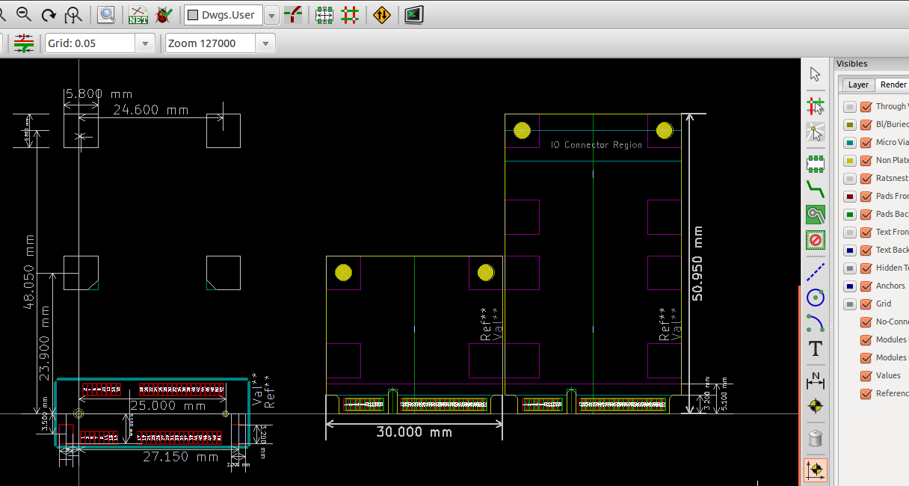

KiCad Mini PCI Express (mPCIe) Library
======================

KiCad Library for creating designs with Mini PCI express (mPCIe) cards.
Includes bits for both "host", a board you plug mPCIe cards into and "cards"
themselves.

Library has;
 * Schematic components.
 * PCB module footprints.
 * KiCad templates (eventually).

Currently status is;

 * PCB module for "Dual-Use Socket" which supports "full size" and "half size"
   mPCIe cards.

 * PCB module for a "full size" mPCIe cards (including board edge).
  * Includes markings for "IO connectors" region.
  * Includes "F2" keep outs marked on the bottom silk screen.

 * PCB module for a "half size" mPCIe cards (including board edege).
  * Includes "H2" keep outs marked on the bottom silk screen.

 * Schematic component for mPCIe socket.

TODO list is;

 - [ ] Create a schematic component for a mPCIe card edge.
 - [ ] Add support for "Dual Head-to-Head" sockets
   - [ ] Create a schematic component.
   - [ ] Create a PCB footprint.
 - [ ] Create a project templates for a mPCIe card;
   - [ ] Create SMBus compatible schematic for auto-detection.
   - [ ] Create an example "USB2.0" only mPCIe card.

 - [ ] Actually verify the designs with real parts.
 - [ ] Build something cool.

Requirements for manufacture
-----------------------------

To get a PCB manufactured which is "mostly" compatible with mPCIe cards you'll
need;

 * 1mm PCB width.
   * Most cheap places seem to do 1.6mm by default.
 * Minimum 0.20mm (~7.87 mils) clearance.
   * 6.00 mils should be fine and supported by most places.
 * Minimum 0.60mm (~23.62 mils) trace element width.
   * Most places should support much better than this.
 * Trace to board-edge clearance 0.55mm (~21.7 mils).

## mPCIe card requirements.

When creating mPCIe cards, your manufacturer will need to satisfy the above
requirements plus a couple of extras.

 * The boards need to be routed / cut out with XXX tolerance.
 * Technically the PCB is suppose to have tapered edges on the side which is
   inserted into the socket. If you don't care about slowly destroying your
   socket then it kind of works. (IE **Don't do this with your $2000 laptop!**)

Parts
======================

The following parts should work in theory:

 * **UNTESTED!** - TE Connectivity / AMP - 2041119-1
   * [1 for $0.72 @ Mouser](http://www.mouser.com/ProductDetail/TE-Connectivity-AMP/2041119-1/?qs=sGAEpiMZZMtWxQ3D3EXBN3JxM32iIIxxBU1I37AUdhw%3d)
 * **UNTESTED!** - FCI - 10123824-A20LF
   * [1 for $1.11 @ Mouser ](http://www.mouser.com/ProductDetail/FCI/10123824-A20LF/?qs=sGAEpiMZZMtWxQ3D3EXBN8%252bIMToTtTg7BVGtVxpLeEk%3d)
 * **UNTESTED!** - JAE Electronics - MM60-52B1-G1-R850
   * [1 for $1.59 @ Digikey](http://www.digikey.com/product-detail/en/MM60-52B1-G1-R850/670-2516-1-ND/2504806)
   * [1 for $1.96 @ Mouser](http://www.mouser.com/ProductDetail/JAE-Electronics/MM60-52B1-E1-R650/?qs=sGAEpiMZZMtWxQ3D3EXBN7ApTxJ1wb7v9g%2f%2fwoAPCuU%3d)
 * **UNTESTED!** - Molex Inc - 048338-0052
   * [1 for $1.76 @ Digikey](http://www.digikey.com/product-detail/en/0483380052/WM9834CT-ND/4176649)
 * **UNTESTED!** - Rabbit Semiconductor - 498-0090
   * [1 for $2.38 @ Digikey](http://www.digikey.com/product-detail/en/498-0090/602-1271-ND/3482024)
   * [1 for $2.38 @ Mouser](http://www.mouser.com/ProductDetail/Rabbit-Semiconductor/498-0090/?qs=sGAEpiMZZMtWxQ3D3EXBN4ZZA46zsq3PiF0nzWM4Pf8%3d)

mSATA
======================

Aparantly [mSATA also uses this connector](http://www.te.com/catalog/products/en?q=2041119-1)?
Investigate!

<blockquote>
Mini-SATA (mSATA)
The connector is similar in appearance to a PCI Express Mini Card interface,
but is not electrically compatible; the data signals (TX±/RX± SATA, PETn0 PETp0
PERn0 PERp0 PCI Express) need a connection to the SATA host controller instead
of the PCI Express host controller.
</blockquote>

Contributing
======================

I **love** contributions. Just fork and send me a pull request! 

**If I don't respond to your pull request within a couple of days, please poke
me!**

If you make (or convert) these to Eagle, I'd be more than happy to include a
link to your repository.

Author & License
======================

This library was created by [Tim 'mithro' Ansell](https://blog.mithis.net/) as
he needed a cheap connector for [John Hedditch's](https://github.com/hedj/)
[GreenArrays based SDR RPi Hat](https://github.com/hedj/radio). **WARNING:**
This project *doesn't* use the mPCIe connector for it's intended usage, so
don't use it as an example.

This library is released under the 
[Apache 2.0 License](http://www.apache.org/licenses/LICENSE-2.0.html).

If you use this library for anything, I'd love an [email](mithro@mithis.com)
with a picture of the project (of course this isn't *required* at all). People
making open source hardware make me happy!
